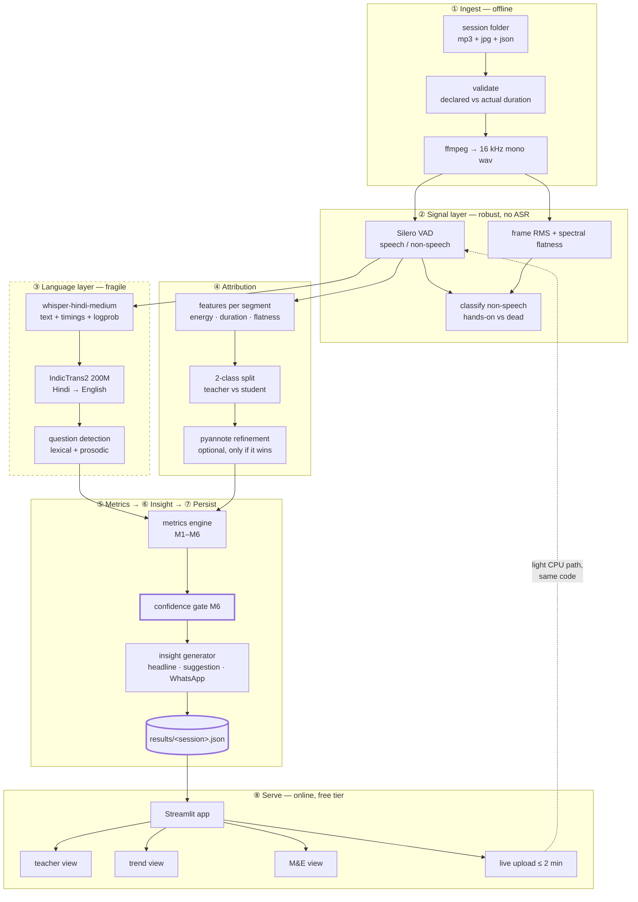
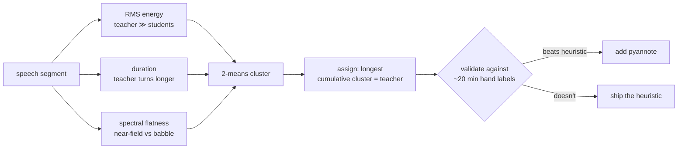
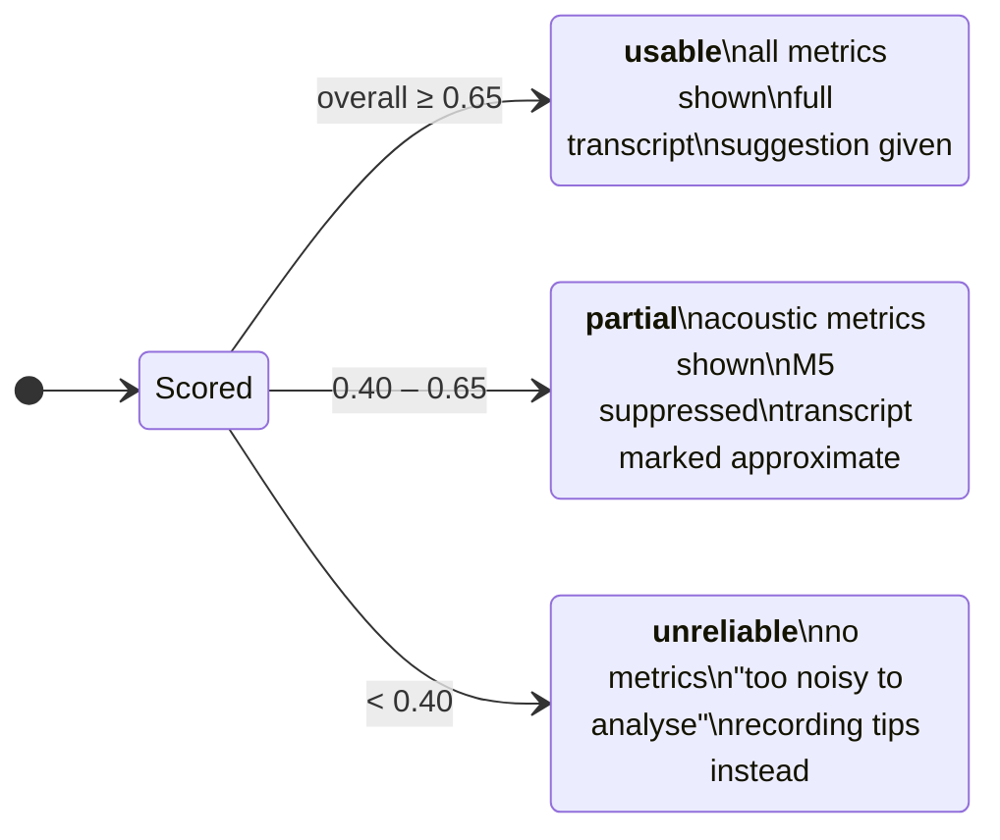
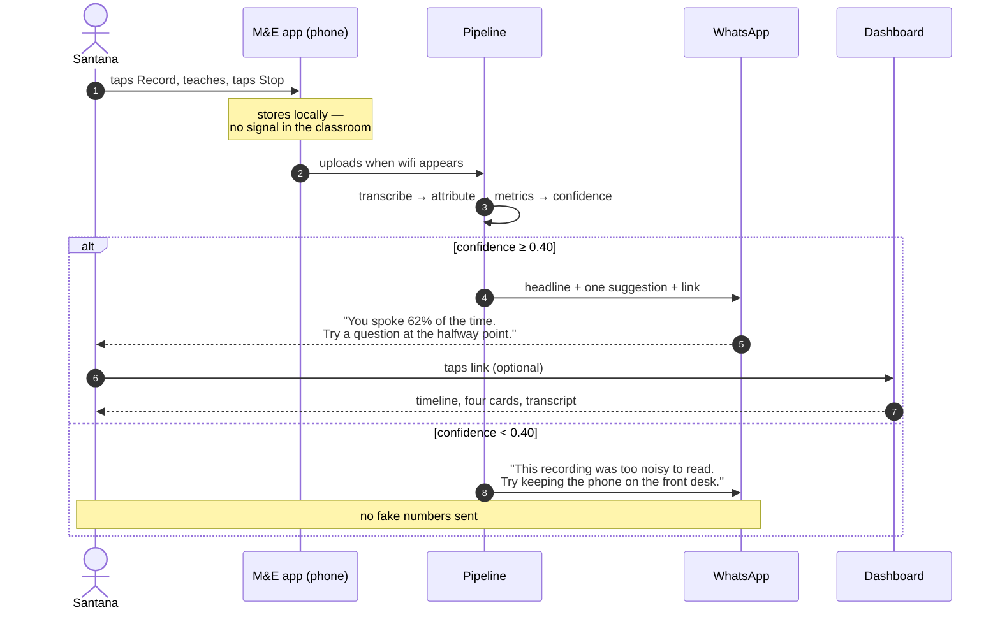
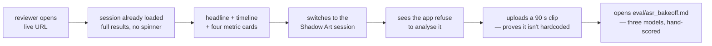

# Task 1 — Architecture & User Workflow

Companion to [`task1-plan.md`](task1-plan.md). This document is written to be lifted almost directly
into the submission README. All mermaid blocks render natively on GitHub.

---

## 1. The one decision everything else follows from

**Heavy work runs offline; the live demo serves precomputed results.**

Three independent constraints force it, and they all point the same way:

| Constraint | Measured | Consequence |
|---|---|---|
| Local CPU transcription | 0.42× realtime (~30 h for the corpus with `whisper-hindi-medium`) | Cannot transcribe on demand |
| Streamlit Community Cloud | 1 GB RAM, CPU-only | Cannot host a model that size |
| HF ZeroGPU, unauthenticated visitor | 2 min GPU/day | One 60-minute file exhausts a reviewer's daily quota |

It is also the honest shape of the real product: a phone in an Igatpuri classroom records for an hour and
syncs when it finds a signal. **Batch-then-serve is production, not a shortcut.**

---

## 2. System architecture



**Read the dashed border on ③ as the warning it is.** Everything inside the language layer degrades with
noise. Stages ②, ④ and the four acoustic metrics do not. The confidence gate ⑤ decides how much of ③ the
user is allowed to see.

---

## 3. Stage specifications

### ① Ingest
Validates before it processes. `declared_sec` comes from the session JSON's `duration`; `actual_sec` comes
from the decoded stream. **Three of five files disagree** (`data-notes.md` §3a), so every downstream
denominator uses `actual_sec` and the delta is recorded as `completeness` and surfaced as a flag.

### ② Signal layer
Silero VAD (bundled with faster-whisper, no extra dependency) splits speech from non-speech. Non-speech is
then split again by energy: **hands-on** (loud, non-speech — children building) vs **dead** (quiet). This
distinction is the difference between a maker-education tool and a generic one; a naive design would score
the Shadow Art session's 80% non-speech as failure when it is probably the class working.

### ③ Language layer
`vasista22/whisper-hindi-medium` with `language="hi"`, word timestamps on, per-segment `avg_logprob`
retained — the logprob is not diagnostics, it is an input to M6. IndicTrans2 gives an English rendering so
non-Hindi reviewers can read the transcript and so question cues can be matched in either language.
Question detection runs lexical first (question words, `?`), with a prosodic fallback (rising F0 over the
final 500 ms of a teacher turn) for when ASR confidence drops.

### ④ Attribution
Binary teacher/student, not per-child diarization — 27 children on one phone mic is not a solvable
identification problem, and pretending otherwise is how a demo falls apart under questioning.

The strong prior: **the recording is made on the teacher's own phone**, so she is consistently the nearest,
loudest, highest-SNR voice.



Hand-label roughly 20 minutes and report real accuracy. An unvalidated classifier is an assertion; a
validated one is evidence, and this is the single cheapest place to demonstrate ML judgement.

### ⑤ Metrics
M1–M4 acoustic (robust), M5 lexical (fragile), M6 governs. Full formulas in
[`task1-plan.md`](task1-plan.md#2-the-metrics).

### ⑥ Insight
Rule-based by default — deterministic, explainable, offline-capable, and structurally incapable of
hallucinating a statistic. An LLM narrative layer is optional and additive, never the source of a number.

### ⑦ Persist
One JSON per session. Small, safe to commit, no raw audio, teacher names replaced by stable aliases.

### ⑧ Serve
Streamlit reads JSON. No model in the serving process, so 1 GB RAM is comfortable and cold starts are fast.
The optional upload path runs the *same pipeline code* on a short clip — which keeps the demo honest
(nothing is hardcoded) without making the demo depend on it.

---

## 4. The data contract

`results/<session_id>.json` is the boundary between offline and online. Everything upstream can be rewritten
freely as long as this shape holds.

```jsonc
{
  "schema_version": "1.0",
  "session_id": "OD11165_2026-01-06-114155",
  "teacher": { "id": "OD11165", "alias": "Teacher B" },   // name never persisted
  "activity": "Trumpet",
  "recorded_at": "2026-01-06T11:41:55+05:30",
  "roster": { "total": 8, "boys": 5, "girls": 3 },

  "audio": {
    "declared_sec": 4134.6,      // from session JSON — untrusted
    "actual_sec": 3858.0,        // decoded — the only denominator used
    "completeness": 0.933,
    "clipping_pct": 0.4,
    "speech_density": 0.856
  },

  "models": {
    "asr": "vasista22/whisper-hindi-medium",
    "mt": "ai4bharat/indictrans2-indic-en-dist-200M",
    "attribution": "energy-kmeans-v1"
  },

  "timeline": [
    { "t0": 12.4, "t1": 19.8, "kind": "speech", "role": "teacher",
      "role_conf": 0.91, "is_question": true, "asr_logprob": -0.61,
      "text_hi": "यह किससे बनाया है?", "text_en": "What is this made from?" },
    { "t0": 19.8, "t1": 23.1, "kind": "speech", "role": "student",
      "role_conf": 0.74, "is_question": false, "asr_logprob": -1.24,
      "text_hi": "कागज़ से", "text_en": "From paper" },
    { "t0": 23.1, "t1": 61.5, "kind": "handson" },
    { "t0": 61.5, "t1": 64.0, "kind": "dead" }
  ],

  "totals_sec": { "teacher": 1420, "student": 890, "handson": 1200, "dead": 348 },

  "metrics": {
    "M1_teacher_talk_ratio":   { "value": 0.615, "band": "high",   "benchmark": 0.40, "confidence": 0.78 },
    "M2_student_participation": { "value": 8.2,   "band": "normal", "unit": "turns/child/hour", "confidence": 0.78 },
    "M3_interaction_density":   { "value": 3.1,   "band": "normal", "unit": "switches/min", "confidence": 0.81 },
    "M4_longest_teacher_stretch": { "value": 412, "band": "high",   "unit": "sec", "confidence": 0.85 },
    "M5_wait_time_1":           { "value": 0.8,   "band": "low",    "unit": "sec", "confidence": 0.41 }
  },

  "confidence": {
    "overall": 0.71,
    "components": { "speech_density": 0.86, "asr_logprob": 0.62,
                    "completeness": 0.93, "attribution_margin": 0.58 },
    "verdict": "usable"          // usable | partial | unreliable
  },

  "insight": {
    "headline": "You spoke 62% of the time — a maker session usually works better below 40%.",
    "suggestion": "Your longest unbroken stretch was 6m 52s. Try breaking it with a question at the halfway point.",
    "whatsapp": "नमस्ते! आज की क्लास: आपने 62% समय बात की...",
    "generated_by": "rules-v1"
  },

  "flags": ["clipping_detected"]
}
```

Two deliberate properties: **`teacher.alias` not `teacher.name`** — the raw name stays out of any file that
could be committed; and **every metric carries its own `confidence`**, not just the session, so M5 can be
suppressed while M1 is still shown.

---

## 5. Confidence gating — what the user sees at each level

`verdict` is derived from `confidence.overall` and changes the whole page, not a footnote on it.



On our own data the Shadow Art session (20% speech density) should land in **unreliable** — and that is the
demo worth showing. Most submissions will print a confident number for that file.

---

## 6. What runs where

| | Offline batch | Online app |
|---|---|---|
| Runs on | Colab free T4 (or local CPU) | Streamlit Community Cloud |
| Frequency | Once per session, ~10–20 min for all five | Every page load, < 1 s |
| Holds models | Yes, ~2.5 GB | No |
| Reads | `data/audio/**` (never committed) | `results/*.json` (committed) |
| Fails how | Loudly, in a log you control | Not in front of the reviewer |

---

## 7. Repository layout

```
classroom-voice-analytics/
├── README.md
├── requirements.txt
├── notebooks/
│   └── batch_colab.ipynb        # the T4 batch pass
├── src/
│   ├── ingest.py                # validate + decode
│   ├── signal_layer.py          # VAD, energy, hands-on vs dead
│   ├── asr.py                   # whisper + logprobs
│   ├── translate.py             # IndicTrans2
│   ├── attribution.py           # teacher vs student
│   ├── metrics.py               # M1–M6
│   ├── insight.py               # rules → headline/suggestion/WhatsApp
│   └── pipeline.py              # orchestration, writes results/*.json
├── results/                     # committed, safe, drives the demo
├── eval/
│   ├── asr_bakeoff.md           # 3 models, hand-scored
│   └── labels/                  # ~20 min hand labels
├── app/
│   └── streamlit_app.py
└── data/                        # gitignored — raw field recordings
```

`eval/` exists as a top-level directory on purpose. It is the part a technical reviewer opens first.

---

## 8. User workflows

### 8a. The teacher — Santana, Igatpuri

Her real channel is **MakerDost on WhatsApp**, not a browser. The dashboard is where she goes when she
wants detail, which is not most weeks.



The whole design goal is that **step 6 is enough**. If she never opens the dashboard, she still got one
usable thing.

### 8b. The M&E lead — Meghamrita

Different question entirely: not "how was my lesson" but "which teachers need support, and is our data
any good?"

| Wants | Screen element |
|---|---|
| Which sessions are analysable at all | Coverage strip — usable / partial / unreliable counts |
| Which teachers are improving | Trend lines per teacher across sessions |
| Where the capture is broken | Data-quality table — truncation, clipping, missing GPS |
| Whether maker sessions differ from lectures | Activity-type breakdown |

The **truncation finding belongs on this screen**. It is an operational bug in their capture app, and
surfacing it is more valuable to MakerGhat than any single lesson metric.

### 8c. The reviewer — first 30 seconds

The grading path. Worth designing explicitly, because a mandatory live link that greets a reviewer with a
spinner has already lost.



Every step is a deliberate answer to something they said they were grading: tool integration, system design
thinking, AI/ML understanding, problem-solving.

---

## 9. Screens

**S1 · Session picker.** Cards: teacher alias, activity, date, duration, confidence badge. The unreliable
session is visible and labelled, not hidden.

**S2 · Teacher view.** Headline sentence → timeline strip (teacher / student / hands-on / quiet, scrubbable)
→ four metric cards, each with a plain-language reading and a benchmark bar → one suggestion → expandable
bilingual transcript.

**S3 · Trend view.** Same teacher across sessions. We have two each for Santana and Sudipto, so this is real
rather than hypothetical.

**S4 · M&E view.** All sessions, data-quality flags, coverage.

**S5 · Try it.** Upload ≤ 2 min, same code path, results in ~30 s.

The **timeline strip is the signature element** — it is the only view that shows the shape of a lesson at a
glance, and it works even when every word in the transcript is wrong.
