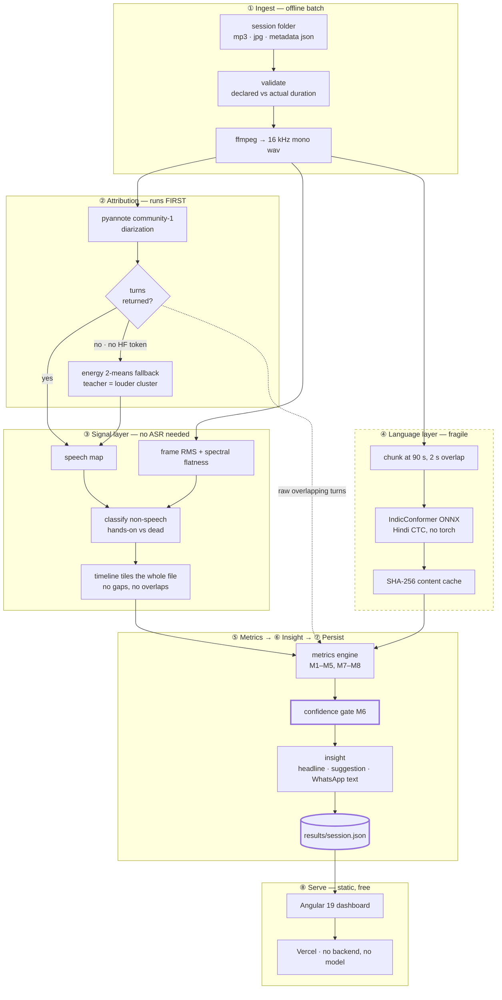
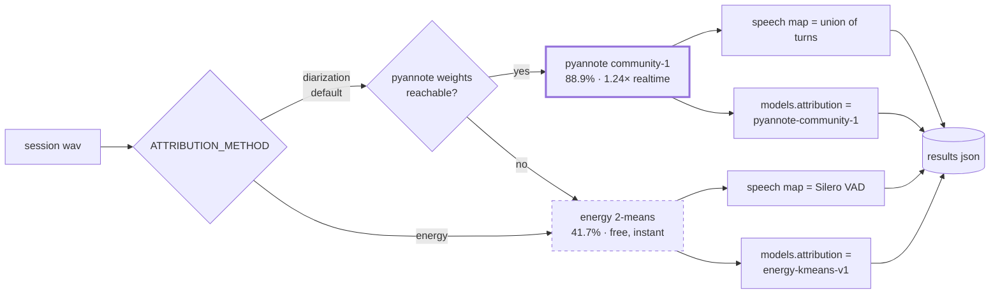
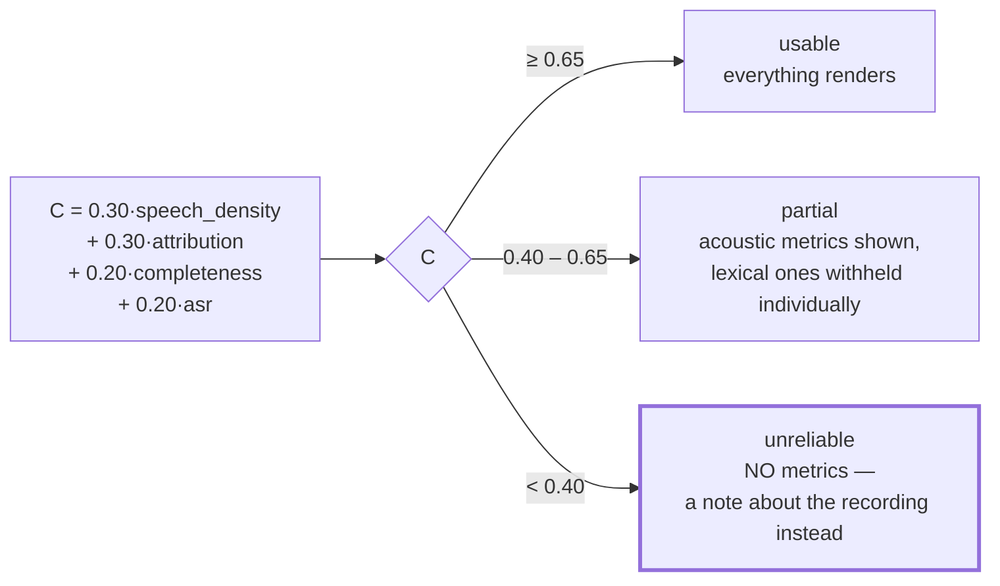
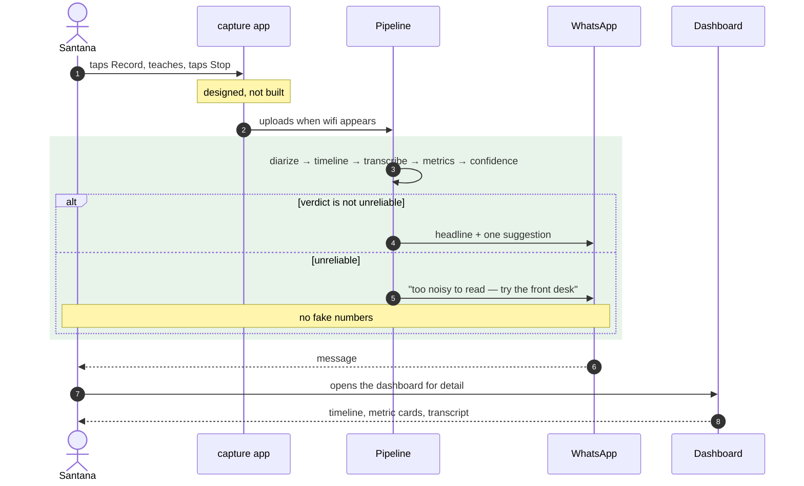
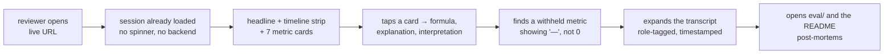

# Task 1 — Architecture & User Workflow

All mermaid blocks render natively on GitHub.

> **This document describes what was built.** An earlier revision described what was *planned*, and the
> two had diverged badly: it named an ASR model that lost the bake-off, a Hindi→English translation stage
> that does not exist, Silero as the speech detector, pyannote as an optional extra, and Streamlit as the
> frontend. Every diagram below is read off the code it claims to describe. Where something is designed
> but **not built**, it says so in the text rather than being drawn as though it ships.

---

## 1. The one decision everything else follows from

**Heavy work runs offline; the live demo serves precomputed results.**

| Constraint | Measured | Consequence |
|---|---|---|
| Diarization | **1.24× realtime** — ~3 h for the corpus | Cannot run on demand, at any price |
| Transcription | **3.78× realtime** with IndicConformer — 67 min for the whole corpus | Affordable in batch, still not per-request |
| The same job on the Hindi Whisper | 0.42× realtime — **38 h** | Model choice moved this by 34× |
| Hosting | Vercel static, no server process | Nothing heavier than a JSON fetch may happen at page load |

It is also the honest shape of the real product: a phone in an Igatpuri classroom records for an hour and
syncs when it finds a signal. **Batch-then-serve is production, not a shortcut.**

---

## 2. System architecture



Two things in that picture are worth stopping on.

**Diarization runs before the timeline and supplies the speech map.** The plan had Silero deciding what
counted as speech and pyannote as an optional refinement afterwards. That is backwards on this audio:
Silero was missing most of the speech on the hands-on sessions and `classify_non_speech` then filed it as
activity noise — **142 s of 161 s** of diarized speech on one session landed in `handson`, so children who
spoke for 67 s were published as having spoken for 1.6 s.

**The dashed border on ④ is the warning it is.** Everything inside the language layer degrades with noise.
Stages ②, ③ and the four acoustic metrics do not. The confidence gate decides how much of ④ anyone sees.

---

## 3. Stage specifications

### ① Ingest
Validates before it processes. `declared_sec` comes from the session JSON's `duration`; `actual_sec` comes
from the decoded stream. **Three of five files disagree** (`data-notes.md` §3a), so every downstream
denominator uses `analysed_sec` and the delta is recorded as `completeness` and surfaced as a flag.

### ② Attribution
Binary teacher/student, not per-child diarization — 27 children on one phone mic is not a solvable
identification problem, and pretending otherwise is how a demo falls apart under questioning.



The energy path's prior was that **the recording is made on the teacher's own phone**, so she is the
nearest, loudest voice. It was measured against 36 hand labels and **lost**: 41.7% against diarization's
88.9% on the same set. It survives as the fallback because it needs no token and no weights, and
`models.attribution` in every result says which one actually ran.

> **Read the 88.9% with care, and say so out loud in an interview.** All 36 hand labels say `teacher`, so
> a classifier that never says "student" scores 100% on that set. The number measures teacher recall only
> — which is exactly why it failed to catch the bug where a teacher's turn *enclosed* every student turn
> and won the tie, mislabelling 100% of student turns on two sessions. `attribution_lost_students` now
> flags that contradiction without needing ground truth at all.

### ③ Signal layer
Splits the recording into segments that **tile it completely** — no gaps, no overlaps — so durations sum
straight into the metrics. Non-speech is split again by energy: **hands-on** (loud, non-speech — children
building) vs **dead** (quiet). That distinction is the difference between a maker-education tool and a
generic one; a naive design scores a session that is 80% non-speech as a failure when it is the class
working.

Where diarization ran, its turn union is the speech map. Silero is only consulted on the fallback path.

### ④ Language layer
`OpenVoiceOS/ai4bharat-indicconformer-hi-onnx` via `onnx-asr`, chosen by measurement, not preference:
**17.3% WER** on `google/fleurs` hi_in against 26.9% for Groq `large-v3` and 63.8% for `whisper-small`.
It is **CTC, so it cannot hallucinate fluently** — the Whisper variants both did, one drifting into
"subscribe" and the other into news bulletins. Two swappable alternatives return the identical
`Transcript`: `local` (faster-whisper Hindi CT2) and `groq`.

Two implementation facts that are load-bearing:

* The ONNX graph has a **fixed positional-encoding length** and dies past ~100 s, so audio is chunked at
  90 s with 2 s of overlap. Before that was found it was silently killing ASR on every session and leaving
  acoustic-only results.
* Transcripts are cached under a **SHA-256 of the audio content** plus a backend/model/language stamp, so
  re-running the metrics costs nothing.

**There is no translation stage.** An earlier plan had IndicTrans2 rendering English alongside the Hindi;
it was never built, and nothing downstream needs it. Question detection is **lexical only** — a fixed list
of Hindi interrogatives, or a `?`. Hindi does not invert word order for questions, so without prosody
there is little else to go on, and the detector is deliberately simple and deliberately fragile.

### ⑤ Metrics
**M1–M4 acoustic** (robust — M3 needs no transcript at all), **M5, M7 and M8 lexical** (fragile),
**M6 governs**. Each carries its own formula, explanation and interpretation *inside the JSON*, so the
dashboard never hardcodes them and they cannot drift from the code that computed them. Full definitions in
the [README](../README.md#the-metrics).

M5, M7 and M8 come out of **one walk over the raw diarization turns**, so the wait time can never disagree
with the counts it was measured from. Raw turns, not the timeline: splitting segments at speaker changes
makes them tile exactly, so a student turn begins the instant the teacher's ends and every gap computes to
0.00 by construction.

### ⑥ Insight
Rule-based — deterministic, explainable, offline-capable, and structurally incapable of hallucinating a
statistic. An LLM narrative layer would be additive, never the source of a number. Emits a headline, one
suggestion, a plain summary, and a WhatsApp-length rendering of the same thing.

### ⑦ Persist
One JSON per session, plus an `index.json` — a static site cannot list a directory, so without the index a
new session is written to disk and stays invisible. Small, safe to commit, no raw audio, teacher names
replaced by stable aliases.

### ⑧ Serve
An **Angular 19 single-page app on Vercel**, built static. It is a reader: the pipeline has already done
every expensive thing, so the page opens instantly, needs no backend and deploys as plain files anywhere.
`results/*.json` are copied in as build assets.

---

## 4. The data contract

`results/<session_id>.json` is the boundary between offline and online. Everything upstream can be
rewritten freely as long as this shape holds. Below is a real file, trimmed.

```jsonc
{
  "schema_version": "1.0",
  "session_id": "OD11165_2026-01-06-114155",
  "teacher": { "id": "OD11165", "alias": "Teacher B" },   // name never persisted
  "activity": "Trumpet",
  "recorded_at": "2026-01-06T12:51:13",
  "roster": { "total": 8, "boys": 5, "girls": 3 },

  "audio": {
    "declared_sec": 4134.6,      // from the session JSON — untrusted
    "actual_sec": 3859.5,        // decoded
    "analysed_sec": 3859.7,      // what the metrics actually divide by
    "completeness": 0.933,
    "sample_rate": 44100, "channels": 1, "has_gps": false
  },

  "models": {                    // which path ran, recorded per session
    "asr": "OpenVoiceOS/ai4bharat-indicconformer-hi-onnx",
    "asr_backend": "indic",
    "attribution": "pyannote-community-1",
    "vad": "pyannote-community-1-segmentation"
  },

  "timeline": [                  // tiles the whole recording, no gaps
    { "t0": 0.0,   "t1": 0.875, "kind": "dead",    "rms_db": -49.70 },
    { "t0": 0.875, "t1": 1.313, "kind": "speech",  "rms_db": -21.76,
      "role": "student", "role_conf": 0.759, "text": "..." },
    { "t0": 1.313, "t1": 2.225, "kind": "handson", "rms_db": -21.96 }
  ],

  "totals_sec": { "teacher": 1866.54, "student": 1088.84,
                  "handson": 210.92, "dead": 676.38, "unattributed": 16.98 },

  "metrics": {
    "M1_teacher_talk_ratio": {
      "value": 0.6316, "unit": "ratio", "band": "normal", "benchmark": 0.4,
      "confidence": 0.759,
      "formula": "teacher_speech_sec / (teacher_speech_sec + student_speech_sec)",
      "explanation": "Share of *spoken* time held by the teacher...",
      "interpretation": "Reported only when the teacher/student split is separable..."
    }
    // M2, M3, M4, M5 and the two counts M7, M8 have the same shape.
    // A value of null means withheld — never 0.
  },

  "confidence": {
    "overall": 0.886,
    "components": { "speech_density": 1.0, "attribution": 0.759,
                    "completeness": 0.933, "asr": 0.856 },
    "verdict": "usable"          // usable | partial | unreliable
  },

  "insight": {
    "headline": "You spoke 63% of the talking time in Trumpet — close to the target.",
    "suggestion": "Nothing stands out to change...",
    "summary": "Trumpet: 49m 15s of talking, 3m 30s hands-on, 11m 16s quiet...",
    "metrics_shown": ["M1_teacher_talk_ratio", "..."],
    "verdict": "usable",
    "generated_by": "rules-v1",
    "whatsapp": "नमस्ते Teacher B! ..."
  },

  "flags": ["audio_truncated", "no_gps"]
}
```

Three deliberate properties: **`teacher.alias`, never `teacher.name`** — the raw name stays out of any file
that could be committed; **every metric carries its own `confidence`**, so M5 can be suppressed while M1 is
still shown; and **`models` records which path actually ran**, so a result never silently implies a quality
it did not have.

> **The numbering runs M1–M5, M7, M8.** M6 is the confidence score, which lives in its own `confidence`
> block because it governs the others rather than sitting beside them. The gap is deliberate, so M6 means
> the same thing in the code, the JSON and the README.

---

## 5. Confidence gating — what the user sees at each level

`verdict` is derived from `confidence.overall` and changes the whole page, not a footnote on it.



There is a second, independent gate that is easy to miss: **M1–M4 are withheld wholesale whenever the
teacher/student split falls below `ROLE_CONF_FLOOR`**, regardless of the overall verdict. A talk ratio
computed from a speaker split you do not believe is not a weak number, it is a meaningless one. On
OD11163_2025-12-23 every segment sat between −27.1 and −29.7 dB — a 2.6 dB spread with nothing to cluster
on — and the pipeline still reported a confident-looking 45% until that floor was added.

> **A prediction this document got wrong, left in on purpose.** The earlier revision said the Shadow Art
> session (27 children, mostly non-speech) "should land in **unreliable** — and that is the demo worth
> showing". It does not. It scores **0.73, `usable`**, and so do the other four. The reason is the
> inversion in §2: once diarization rather than Silero supplied the speech map, the "20% speech density"
> reading turned out to be a measurement artefact, not a property of the recording. The gate is still
> doing its job — it withholds individual metrics on sessions where the split is weak — but no session in
> this corpus trips the bottom band.

---

## 6. What runs where

| | Offline batch | Online app |
|---|---|---|
| Runs on | Local CPU — no Colab, no GPU, no API key | Vercel static hosting |
| Frequency | Once per session; ~3 h for all five, dominated by diarization | Every page load, < 1 s |
| Holds models | Yes — pyannote 64 MB + IndicConformer 132 MB, ~200 MB total | No |
| Reads | `data/audio/**` (never committed) | `results/*.json` (committed) |
| Fails how | Loudly, in a log you control | Not in front of the reviewer |

---

## 7. Repository layout

```
task1-classroom-voice-analytics/
├── README.md
├── requirements.txt             # derived by AST-walking the imports, not by hand
├── src/
│   ├── ingest.py                # validate + decode
│   ├── signal_layer.py          # VAD, energy, hands-on vs dead
│   ├── diarization.py           # pyannote, turn union, speaker splitting
│   ├── attribution.py           # energy 2-means fallback
│   ├── asr/                     # base contract + indic | local | groq + cache, chunking
│   ├── metrics.py               # M1–M5, M7–M8, the confidence gate (M6)
│   ├── insight.py               # rules → headline / suggestion / WhatsApp
│   ├── pipeline.py              # assembles one result
│   ├── run_pipeline.py          # batch orchestration over the corpus
│   └── evaluation/              # bake-off + WER benchmark harness
├── results/                     # committed, safe, drives the demo
├── eval/
│   ├── asr_bakeoff.md           # models, hand-scored
│   └── labels/                  # hand labels for attribution
├── app/                         # Angular 19 dashboard, deployed to Vercel
└── data/                        # gitignored — raw field recordings
```

`eval/` exists as a top-level directory on purpose. It is the part a technical reviewer opens first.

---

## 8. User workflows

### 8a. The teacher — Santana, Igatpuri

Her real channel is **MakerDost on WhatsApp**, not a browser.

> **Built vs designed.** The pipeline *generates* the WhatsApp message and caps it at 400 characters, and
> it is rendered on the dashboard as "what she receives". **Nothing sends it** — there is no WhatsApp
> integration and no recording app. The sequence below is the product this slots into; the boxed steps are
> the parts that exist today.



The design goal is that **the message alone is enough**. If she never opens the dashboard, she still got
one usable thing.

### 8b. The M&E lead — Meghamrita

A different question: not "how was my lesson" but "which teachers need support, and is our data any good?"

| Wants | Where it is today |
|---|---|
| Which sessions are analysable at all | Confidence badge + verdict per session ✅ |
| Which teachers are improving | Sessions grouped by teacher alias ✅ (grouping, not trend lines) |
| Where the capture is broken | Data-quality notes — truncation, missing GPS ✅ |
| Whether maker sessions differ from lectures | Not built — activity is recorded but not aggregated |

The **truncation finding belongs on this screen**. It is an operational bug in their capture app, and
surfacing it is worth more to MakerGhat than any single lesson metric.

### 8c. The reviewer — first 30 seconds

The grading path. Worth designing explicitly, because a mandatory live link that greets a reviewer with a
spinner has already lost.



Every step answers something they said they were grading: system design, AI/ML understanding,
problem-solving, code quality.

---

## 9. Screens

The app is **one page**, not five. That is a deliberate simplification of the original plan, and the
elements below are what it actually renders.

**Session picker** — every session listed under its teacher's alias, with activity, date and a confidence
badge. A low-confidence session is visible and labelled, never hidden.

**Headline + summary** — one plain sentence about the lesson, and the WhatsApp message beside it.

**Timeline strip** — teacher / student / hands-on / quiet across the whole recording. **The signature
element:** the only view that shows the shape of a lesson at a glance, and it works even when every word in
the transcript is wrong.

**Metric cards** — seven, each expanding to its formula, explanation and interpretation. A withheld metric
renders as `—` with the reason, and counts render without a gauge because a count has no ceiling.

**Transcript** — collapsed by default, role-tagged and timestamped.

**How this session was processed** — which ASR, which attribution, which VAD, plus the confidence
breakdown. A reviewer should not have to open the JSON to find out which path ran.

> **Not built:** an upload path. The earlier plan had a "Try it" screen taking a ≤ 2-minute clip through
> the same code to prove nothing is hardcoded. It is a good idea and it is not there — the live demo
> serves precomputed results only, and the way to verify the code is to run `python -m src.run_pipeline`.
